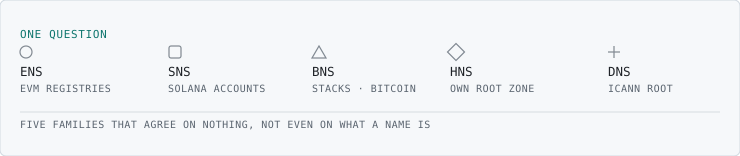

<picture>
  <source media="(prefers-color-scheme: dark)" srcset="./assets/header-dark.svg">
  
</picture>

# Hi, I'm TchikTchakX

I build browser-only clients that read blockchains directly. For that kind of work: no backend, no API keys, no framework. Just vanilla JS, RPC nodes, and a lot of async debugging.

The work I care about is **name resolution**: turning a name into what it actually points to on-chain, and being able to show that the answer is real.

These days I'm the engine half of other people's projects. They bring the audience, the campaign, everything an engine can't do on its own; I bring the part that still has to be right when a stranger re-runs it.

### The work

Same question every time. What changes is the system you ask, and every one of them is unreliable in a different way.

| Project | What it does | Reads | State |
|---|---|---|---|
| **Freenamers** | Universal name resolver, browser-only, no backend. Forward and reverse. | 9 name services across EVM, Solana and Stacks | [Closed, August&nbsp;2026](https://resolver.freenamers.com "What happened, and what the resolver does now") |
| **TLDsHNS** | Marketplace and demand signalling for Handshake TLDs. Search, signal, acquire on-chain. | Handshake | In development |
| **Community App** | Domain toolkit for holders. Web2 utilities next to on-chain lookups. | DNS, WHOIS, on-chain | In development |
| **Lab** | Prototypes and protocol experiments. Most of it never ships, and that's the point. | whatever the experiment needs | Side project |

Freenamers ran until August 2026. The site closed; the resolver didn't.

### What I work with

<picture>
  <source media="(prefers-color-scheme: dark)" srcset="./assets/families-dark.svg">
  
</picture>

**Core frontend.** JavaScript (async/await, promises, race conditions, ES modules), HTML/CSS without a framework, Vite, Git.

**Chain reading. No name-service SDK, on any chain.** viem for EVM, `@solana/web3.js` for Solana, Clarity reads on Stacks. Those are primitives: hashing and transport. Before any of it, a name has to become an identifier, and that part is written here:

| Name service | What a name has to become |
|---|---|
| ENS, Basenames, 3DNS, Space&nbsp;ID, UD | a 32-byte node |
| Freename | a token id |
| SNS | a program-derived account |
| BNS | a Clarity principal |
| ENS multichain records | a chain-specific address |

Four of those five are written down somewhere public. Freename isn't: it publishes no spec for how a name becomes a token id. I worked that derivation out by reading the contract, and it has been in production ever since.

**The part that doesn't show in a stack list.** Resilience engineering for networks you don't control. Public nodes rate-limit you, disagree with each other, answer slowly, or answer `null` when they mean *I don't know*. Names arrive that look identical and aren't. Most of the work is there, and none of it is visible when it goes right.

**Off to the side.** Python for tooling, containers when something needs one, a native shell. None of it is what I'm hired for, and it stays that way.

### Why this combination is rare

Two crafts that rarely meet, and each is blind exactly where the other looks.

| A frontend dev rarely meets | A chain dev rarely worries about |
|---|---|
| a source that answers wrongly instead of failing | what the screen shows while the answer is still coming |
| one question that needs five incompatible derivations | a reader with no wallet extension, behind an ad-blocker |
| data written by a stranger, rendered in your own page | whether a partial answer is still an honest one |

### How I audit my own work before shipping

The nine axes, one line each

| Axis | What I check |
|---|---|
| **Reliability** | Retry, failover, circuit breaker, cache: is every failure path covered? |
| **Performance** | Time budget per resolution path, redundant calls, timeout calibration |
| **Security** | XSS from malicious on-chain records, input validation, no client-side secrets, CSP |
| **Maintainability** | Coupling to third-party libs, debt from workarounds, consistent error handling |
| **Correctness** | Owner vs manager vs resolved address, stale cache, search race conditions |
| **Edge cases** | Expired names, wallets with hundreds of names, ad-blockers, empty records |
| **UX under constraint** | Progressive feedback during multi-second waits, typed error states |
| **Observability** | Per-resolution breadcrumbs, error rates by provider, user feedback loop |
| **Browser compat** | Ad-blocker interference, neutral URL choices, no wallet extension required |

Vitest and Playwright for the suites, ESLint for the sinks that render HTML.

### On closed source

The engines I work on are private for now. I'd rather say that plainly than publish a repository and let it imply something it can't prove.

Publishing source doesn't establish what actually runs. Without reproducible builds and signed provenance, there is no verifiable link between a repository and the artifact serving you, and for anything running on a server there is no link at all. Open source is an act of good faith. It isn't evidence.

So I put the burden somewhere else. **The outputs are replayable.** When a tool of mine claims a name resolves to an address, it publishes what was queried, on which contract, at which block. You re-run it against any node you trust and you get the same answer, or you don't. You never have to take my word for it, because the claim doesn't rest on the code.

### What I'm not

I'm not a Solidity developer. I read contracts, I don't write them. 
I'm not a full-stack engineer. The reading tools have no backend, by design. 
I don't use React or Vue for the reading tools. The constraints (bundle size, load time, lazy-loading chain SDKs on demand) pointed to vanilla JS, and it turned out to be the right call. A marketplace is a different problem, and it gets different tools.

---

→ [x.com/tchiktchakx](https://x.com/intent/follow?screen_name=tchiktchakx)
